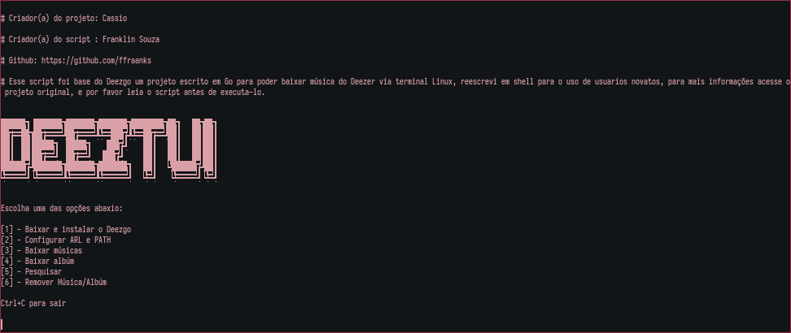

# DeezTUI

O DeezTUI é um script bash baseado no [Deezgo](https://gitlab.com/heyitscassio/deezgo) reescrevi em shell para facilitar o uso de novos users.

## Baixar, instalar e usar:

```
cd $HOME/.local/bin && wget -c "https://github.com/ffraanks/deeztui/raw/master/deeztui" && chmod +x deeztui && ./deeztui
```

### DeezTUI:


